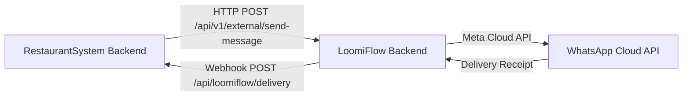

# Fix All Bugs + LoomiFlow WhatsApp Integration

## Background

The audit found 52 bugs, 52 security vulnerabilities, and 23 incomplete features. Additionally, the RestaurantSystem's `whatsappService.ts` is a stub that only `console.log`s messages. LoomiFlow is a production WhatsApp CRM built on Meta Cloud API with BullMQ workers, broadcast, templates, and lead management.

**Integration Strategy**: RestaurantSystem will call LoomiFlow's API to send WhatsApp messages (order confirmations, feedback, campaigns). LoomiFlow doesn't need to know about restaurant internals — it just receives "send this message to this phone" requests via a shared API key.

---

## Phase 1 — Critical Security Fixes (MUST DO FIRST)

> [!CAUTION]
> These items are **blocking for any production deployment**. Attackers can forge JWTs, create arbitrary orders, and brute-force OTPs right now.

### 1.1 Remove Hardcoded Secret Fallbacks
#### [MODIFY] [jwt.ts](file:///Users/baburhussain/Documents/RestaurantSystem/apps/backend/src/utils/jwt.ts)
- Change `process.env.JWT_SECRET || 'fallback-secret-for-dev'` → throw error if `JWT_SECRET` is missing
- Same for `customerAuth.controller.ts` and `billing.controller.ts` Razorpay keys

#### [MODIFY] [auth.controller.ts](file:///Users/baburhussain/Documents/RestaurantSystem/apps/backend/src/controllers/auth.controller.ts)
- Remove the entire `devLogin` function (dead code, SUPER_OWNER backdoor)
- Fix `customerLogin` to use the centralized JWT utility instead of inline `require('jsonwebtoken')`

#### [MODIFY] [onlineOrder.controller.ts](file:///Users/baburhussain/Documents/RestaurantSystem/apps/backend/src/controllers/onlineOrder.controller.ts)
- Remove `'fallback_secret'` from webhook secret fallback

---

### 1.2 Stop Mass Assignment (`...req.body` spreading)
#### [MODIFY] 7 controllers:
- `expense.controller.ts` — whitelist `category, amount, date, isGstEligible`
- `tds.controller.ts` — whitelist `vendorName, panNumber, section, tdsAmount, tdsRate, paymentDate`
- `staff.controller.ts` — whitelist `name, phone, role, designation, salary, shift, joiningDate`
- `branch.controller.ts` — whitelist `name, address, city, phone, gstNumber`
- `inventory.controller.ts` — whitelist `name, contactPerson, phone, email, address`
- `integration.controller.ts` — whitelist `platform, apiKey, apiSecret, webhookSecret, storeId`
- `menu.controller.ts` — whitelist menu item fields explicitly

---

### 1.3 Add Input Validation (Zod Schemas)
#### [NEW] [validations/](file:///Users/baburhussain/Documents/RestaurantSystem/apps/backend/src/validations/)
Create Zod schemas for the most critical routes:
- `auth.schema.ts` — login, invite-staff
- `order.schema.ts` — createOrder, addItems, createTakeaway
- `billing.schema.ts` — previewBill, finalizeBill
- `customer.schema.ts` — OTP send/verify
- `expense.schema.ts` — create expense

Apply `validate()` middleware to these routes.

---

### 1.4 Authenticate Unauthenticated Endpoints
#### [MODIFY] [onlineOrder.routes.ts](file:///Users/baburhussain/Documents/RestaurantSystem/apps/backend/src/routes/onlineOrder.routes.ts)
- `requestBill` — add basic session/JWT check
- `payOnlineOrder` — add basic session/JWT check
- Keep `createOnlineOrder` public but add captcha/rate-limit
- Keep `verifyPaymentWebhook` public (webhook) but make secret REQUIRED

---

### 1.5 Rate Limit OTP Endpoints
#### [MODIFY] [customerAuth.routes.ts](file:///Users/baburhussain/Documents/RestaurantSystem/apps/backend/src/routes/customerAuth.routes.ts)
- Add rate limiter: 5 OTP sends per phone per 15 minutes
- Add rate limiter: 5 OTP verify attempts per phone per 15 minutes

---

### 1.6 Hash OTPs + Use Crypto-Secure Generation
#### [MODIFY] [customerAuth.controller.ts](file:///Users/baburhussain/Documents/RestaurantSystem/apps/backend/src/controllers/customerAuth.controller.ts)
- Replace `Math.random()` with `crypto.randomInt(100000, 999999)`
- Hash OTP with bcrypt before storing
- Compare with `bcrypt.compare()` on verify
- Remove dev mode OTP leak (`...(devMode && { otp })`)

---

### 1.7 Timing-Safe HMAC Comparisons
#### [MODIFY] [onlineOrder.controller.ts](file:///Users/baburhussain/Documents/RestaurantSystem/apps/backend/src/controllers/onlineOrder.controller.ts)
#### [MODIFY] [integration.controller.ts](file:///Users/baburhussain/Documents/RestaurantSystem/apps/backend/src/controllers/integration.controller.ts)
- Replace `digest !== req.headers[...]` with `crypto.timingSafeEqual(Buffer.from(digest), Buffer.from(sig))`

---

### 1.8 Socket.io Auth Enforcement
#### [MODIFY] [index.ts](file:///Users/baburhussain/Documents/RestaurantSystem/apps/backend/src/index.ts)
- Reject socket connections with no valid token (don't just set `user = null`)
- Add `OWNER` role check in `requireBranchAccess`
- Add auth check on `join_order` event

---

## Phase 2 — Bug Fixes

### 2.1 Fix Critical Bugs
#### [MODIFY] [auth.routes.ts](file:///Users/baburhussain/Documents/RestaurantSystem/apps/backend/src/routes/auth.routes.ts)
- Fix `UserRole.MANAGER` → `UserRole.BRANCH_MANAGER`

#### [MODIFY] Queue Name Mismatch
- `config/queue.ts` uses `'MenuSync'`, `workers/menuSync.worker.ts` uses `'menu-sync'`
- Standardize to `'menu-sync'` in both files

#### [MODIFY] [order.controller.ts](file:///Users/baburhussain/Documents/RestaurantSystem/apps/backend/src/controllers/order.controller.ts)
- Server-side price validation: lookup `MenuItem` prices from DB instead of trusting `priceAtOrderTime`
- Remove fake `tableId` for takeaway orders — use `null` instead

#### [MODIFY] [onlineOrder.controller.ts](file:///Users/baburhussain/Documents/RestaurantSystem/apps/backend/src/controllers/onlineOrder.controller.ts)
- Server-side price validation
- Remove inline `require('mongoose')` — use top-level import
- Fix `paymentStatus` ternary that always returns `'PENDING'`

---

### 2.2 Fix Medium Bugs
#### [MODIFY] [order.controller.ts](file:///Users/baburhussain/Documents/RestaurantSystem/apps/backend/src/controllers/order.controller.ts)
- Escape regex special characters in search query

#### [MODIFY] [index.ts](file:///Users/baburhussain/Documents/RestaurantSystem/apps/backend/src/index.ts)
- Add graceful shutdown handler (SIGTERM/SIGINT)
- Deduplicate Redis connections (use one shared IORedis instance)
- Remove duplicate AI controller/route files (`aiController.ts` → merge into `ai.controller.ts`)

#### [MODIFY] [campaign.controller.ts](file:///Users/baburhussain/Documents/RestaurantSystem/apps/backend/src/controllers/campaign.controller.ts)
- Use MongoDB transactions for bulk loyalty point updates
- Set campaign status after SMS sending completes (not before)

---

### 2.3 Frontend Fixes
#### [MODIFY] Customer-web `Checkout.tsx`
- Replace `'rzp_test_stub'` with env variable `import.meta.env.VITE_RAZORPAY_KEY`
- Replace `'fallback_id'` with proper error handling

#### [NEW] Error boundary component for both `web` and `customer-web`

---

## Phase 3 — LoomiFlow ↔ RestaurantSystem WhatsApp Integration

> [!IMPORTANT]
> This is a **cross-project API integration**. LoomiFlow already has a production WhatsApp Cloud API service. We'll expose a lightweight REST endpoint on LoomiFlow that the RestaurantSystem can call to send messages.

### Architecture



### 3.1 LoomiFlow Side — New External API
#### [NEW] [external.routes.ts](file:///Users/baburhussain/LoomiFlow/backend/src/routes/v1/external.routes.ts)
New route file for partner integrations:
- `POST /api/v1/external/send-message` — accepts `{ apiKey, to, message, templateName?, components? }`
- `POST /api/v1/external/send-template` — send template messages with variables
- Authenticated via `x-api-key` header matched against factory's `externalApiKey` field

#### [MODIFY] [index.ts (routes)](file:///Users/baburhussain/LoomiFlow/backend/src/routes/v1/index.ts)
- Mount `externalRoutes` on `/external`

#### [NEW] [external.service.ts](file:///Users/baburhussain/LoomiFlow/backend/src/services/external.service.ts)
- `sendExternalMessage(apiKey, to, message)` — validates API key, finds factory, calls `whatsappService.sendTextMessage()`
- `sendExternalTemplate(apiKey, to, templateName, components)` — same for templates

---

### 3.2 RestaurantSystem Side — Replace WhatsApp Stub
#### [MODIFY] [whatsappService.ts](file:///Users/baburhussain/Documents/RestaurantSystem/apps/backend/src/services/whatsappService.ts)
Replace the stub with a real LoomiFlow HTTP client:
```typescript
// Real WhatsApp via LoomiFlow API
const LOOMIFLOW_URL = process.env.LOOMIFLOW_API_URL; // e.g. http://localhost:3001/api/v1/external
const LOOMIFLOW_API_KEY = process.env.LOOMIFLOW_API_KEY;

export const sendWhatsAppNotification = async (phone: string, message: string) => {
    const res = await fetch(`${LOOMIFLOW_URL}/send-message`, {
        method: 'POST',
        headers: { 'Content-Type': 'application/json', 'x-api-key': LOOMIFLOW_API_KEY },
        body: JSON.stringify({ to: phone, message })
    });
    return res.json();
};
```

#### [MODIFY] Restaurant settings page — add LoomiFlow API key config field in settings UI

---

### 3.3 Template Messages for Key Events
Create WhatsApp Business message templates in LoomiFlow for:
1. **Order Confirmation** — "Your order #{orderId} is confirmed! ETA: {time} mins"
2. **Order Ready** — "Your order #{orderId} is ready for pickup!"
3. **Feedback Request** — "How was your experience? Rate us: {link}"
4. **Campaign** — "{restaurant_name}: {offer_text}. Valid until {date}"

---

## Open Questions

> [!IMPORTANT]
> 1. **LoomiFlow deployment**: Is LoomiFlow running locally or on a remote server? The integration URL needs to be configured.
> 2. **WhatsApp Business Account**: Is there a Meta Business phone number already connected in LoomiFlow? If not, messages will only work in test mode.
> 3. **Priority**: Should I do Phase 1 (security) first, or do you want all phases done in parallel?

---

## Verification Plan

### Automated Tests
- After each phase, restart the backend and verify no startup errors
- Test critical endpoints via browser subagent:
  - Login flow
  - Order creation
  - OTP send/verify
  - Expense creation

### Manual Verification
- Confirm LoomiFlow API responds to `POST /external/send-message`
- Confirm RestaurantSystem's WhatsApp functions route through LoomiFlow
- Check that hardcoded secrets are gone (grep for `fallback`)
